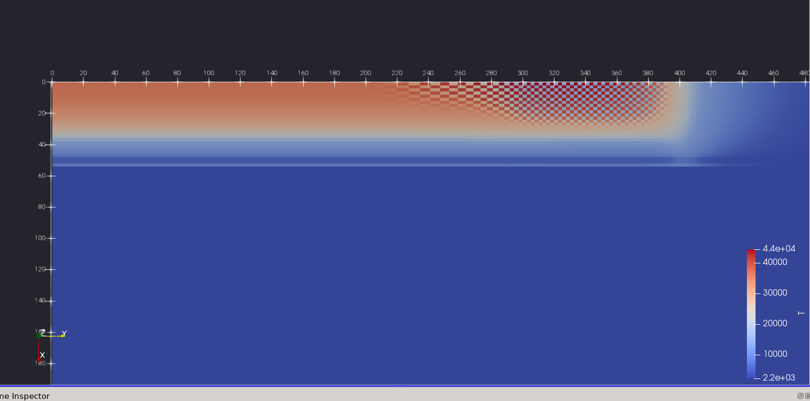

# Instabilità temperatura nel capillare

Succede ad un certo punto, per esempio nella sim I245-1cm/rho0.25 all'output vtk 24 (cioè a circa 120ns).
+ Ho provato ad aumentare il numero di sottopassi della conduzione termica DA 30 60 (rho0.25_r11-NSUBS_TC60), ma l'instabilità sorge comunque (pare anche negli stessi tempi).
+ Pare che se aumento il numero di sottopassi complessivi di adi (NSUBS_ADI_TOT da 2 a 4, tenendo uguale NSUBS_TC, cioè 30; il che fa 30*4=120 sottopassi di conduzione per ogni dt idrodinamico), cioè faccio ricalcolare più spesso le proprietà del fluido (kappa, capacità termica) l'instabilità tardi a nascere, di circa 15ns. Vedi sim rho0.25_r11-NSUBS_TOT4.
+ Ho fatto una sim con NSUBS_ADI_TOT 8: I245-1cm/rho0.25_r11-NSUBS_TOT8. Si è fermata a 243ns, ma per un problema diverso. Cioè il fatto che in punto vicino all'angolo del muro del capillare la temperatura sale oltre il limite delle tabelle dei parametri del trasporto. Ma non è instabilità a "scacchiera" è solo che la temperatura in quel punto (e nei vicini) oscilla nel tempo (un po' come vedevo fare al campo magnetico) forse perchè la temperatura nelle celle vicine varia troppo velocemente nel tempo e la capacità termica della cella è troppo piccola per tenere stabile il metodo sotto l'influenza di perturbazioni(per curare questo tipo di instabilità, non quello a scacchiera, devi forse aumentare NSUBS_TC (analogamente a quanto faresti con il campo magnetico, ovvero aumenteresti NSUBS_RES)).

Dagli esiti si deduce che potrebbe essere dovuta o alla non linearita' dei paramtri del trasporto e della capacita' termica, che con NSUBS_ADI_TOT basso vengono aggiornati poco di frequente, oppure ad uno scarso accoppiamento tra diffusione di B e diffusione di T. _Nota che la diffusione di B da un termine sorgente per l'equazione del calore, che e' quella che viene in parte avanzata dalla diffusione di T_.
Ho provato ad aumentare NSUBS_ADI_TOT senza aumentare il numero di volte che vengono ricalcolati i parametri del trasporto (+ cap. termica) e ho visto che sono riuscito a non far sorgere l'instabilitia' (confronta file:///home/ema/simulazioni/sims_pluto/perTesi/rho8e-8-I235-3.2cmL-1mmD-r60 e
file:///home/ema/simulazioni/sims_pluto/perTesi/rho8e-8-I235-3.2cmL-1mmD-r60-NTOT32-diffRecPeriod8).
**Quindi l'instabilita' e' effettivamente dovuta allo scarso accoppiamento tra diffusione B e T, e si risolve alzando NSUBS_ADI_TOT**, **ma** per non ridurre troppo la performance **posso ridurre il n^ di volte che venogno ricalcolati i parametri del trasporto** (settando il periodo di ricalcolo degli operatori diffusivi, in definitions.h: DIFF_OP_RECOMPUTE_PERIOD) (vedi che infatti non cambiano quasiper nulla le soluzioni tra le due simulazioni suddette, eccetto che per l'instabilita' che ad un certo punto sorge).
